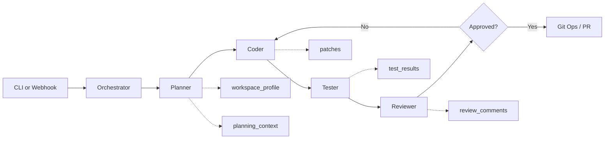
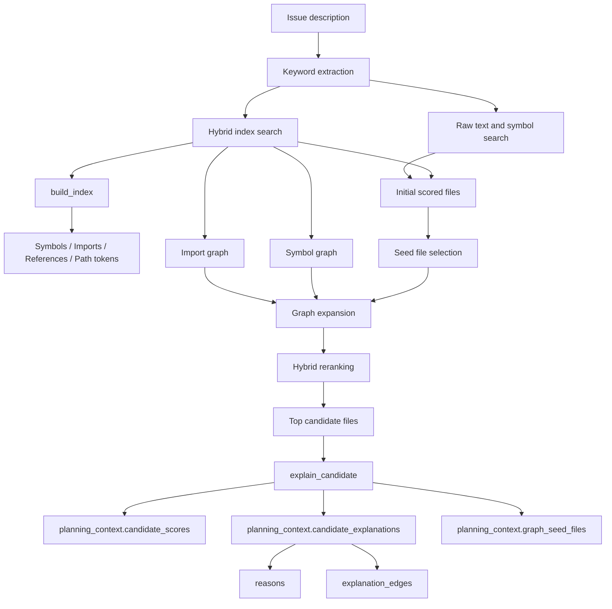

# AI Code Agent - Project Structure & Agent Guide

Welcome to the AI Code Agent project! This file serves as the primary documentation for both human developers and AI coding assistants navigating this repository.

## Purpose

This project is an autonomous software engineering agent system. It is designed to take an issue description, search the codebase, formulate a plan, edit code, run tests within a sandbox, and ultimately submit a Pull Request.

## Current Status and Future

Current status:

1. `v0.9.0` is the current project baseline.
2. The planner, coder, tester, and reviewer loop is working end-to-end with persisted execution metrics and diagnose output.
3. Next.js and NestJS workflows are supported with committed smoke fixtures and full validation coverage.
4. Retrieval is hybrid and explainable through candidate reasons, explanation edges, graph seed files, and structured `edit_intent`.
5. Review-driven remediation, tester `targeted_retry`, adaptive retry-policy selection from recent run history, and retry-effectiveness diagnostics are implemented and validated.
6. Team-safety controls now include file edit policy enforcement, structured review summaries, audit trails, retry recovery reporting, provider-aware issue/PR workflow publishing, richer retry-policy stop decisions based on recent run history, and operator-facing failure taxonomy with dashboard-ready diagnostics.

Future:

- Further GitHub and Azure DevOps workflow support, including richer branch policies, linking, and PR metadata.
- Better sandbox backends, including stronger remote or production-like execution options.
- Further retry orchestration tuning based on larger historical windows, operator feedback, and richer stop/continue policies.
- Better operator diagnostics on top of the current dashboard-oriented summaries, including richer comparisons and downstream reporting surfaces.
- Final product-baseline hardening toward `v1.0.0`, including more stable multi-stack support, onboarding, and operational guidance.

## Architecture Highlights

We use a Multi-Agent architecture orchestrated via a State Machine. When `langgraph` is installed the project uses it directly; otherwise it falls back to a local in-process executor so the CLI can still run smoke checks.

### End-to-End Flow

1. The CLI or webhook receives an issue description plus a repository path.
2. The orchestrator creates an `AgentState` payload and runs the planner, coder, tester, reviewer, and PR stages.
3. The planner profiles the workspace, retrieves relevant files, records planning metadata in `planning_context`, and can emit structured `edit_intent` targets for downstream coding.
4. The coder applies deterministic framework-aware scaffolding when possible, then falls back to LLM-guided edits and can consume planner `edit_intent` plus reviewer remediation context on retry loops.
5. The tester runs repository-appropriate validation, using Docker when available or local execution as fallback, and can switch between full validation and targeted retry validation based on prior failure signals while recording skipped-command and command-reduction effectiveness data.
6. The reviewer combines changed files, validation signals, and generated summaries to decide whether the run is acceptable, and now emits structured remediation guidance when another coding pass is required.
7. If approved, the workflow can proceed to git operations and PR creation, including remote GitHub issue enrichment, Azure DevOps work-item enrichment, and provider-aware PR publishing when credentials are configured.

### Retrieval Architecture

The planner no longer relies only on raw text grep. Retrieval is now a hybrid pipeline built around `ai_code_agent/tools/code_search.py`.

- `build_index()` classifies files and extracts symbols, imports, import paths, references, and path tokens.
- `hybrid_search()` adds structured relevance scoring on top of simple keyword matching.
- `build_import_graph()` links files through resolved Python and JS/TS imports.
- `build_symbol_graph()` links files through symbol definition and usage relationships.
- `graph_related_files()` expands candidate sets from graph neighbors so the planner can pull in connected implementation files.
- `explain_candidate()` emits both human-readable `reasons` and machine-readable `explanation_edges` so retrieval decisions are inspectable.

The planner stores retrieval output in `planning_context`, including:

- `retrieval_strategy`
- `graph_seed_files`
- `candidate_scores`
- `candidate_explanations`
- `candidate_explanations_schema_version`
- `remediation`
- `edit_intent`

### Code Structure

- `/ai_code_agent/orchestrator.py`: The heart of the system. Defines the `AgentState` and the LangGraph flow connecting all agents.
- `/ai_code_agent/agents/`: Directory containing specific agent logic (`planner.py`, `coder.py`, `reviewer.py`, `tester.py`).
- `/ai_code_agent/tools/`: The Agent-Computer Interface (ACI). Tools for agents to touch the real world safely (e.g., `file_editor.py`, `code_search.py`, `sandbox.py`).
- `/ai_code_agent/integrations/`: Connectors to GitHub, Azure DevOps, etc.
- `/ai_code_agent/llm/`: Centralized LLM client and prompts.
- `/ai_code_agent/main.py`: CLI Entrypoint.
- `/ai_code_agent/webhook.py`: Server entrypoint for responding to events.

## Agent Workflow Loop

1. **Planner**: Decides *what* to do based on the issue and code context.
	Planner output also carries retrieval evidence in `planning_context` so downstream tooling can inspect why candidate files were selected, and retry loops can attach structured `edit_intent` targets plus remediation-aware focus files.
2. **Coder**: Edits files based on the plan.
3. **Tester**: Runs smoke checks in a sandbox, falling back to local execution when Docker is unavailable; retry attempts can narrow validation to failed labels, failed commands, and visual-review blockers.
4. **Reviewer**: Evaluates diffs and test results, and returns structured remediation guidance when the workflow should loop back to coding; downstream observability now tracks whether those retry loops actually recovered.
5. **Decide**: The orchestrator assesses the Reviewer's feedback. If failed, it loops back to Coder. If passed, it interacts with Git to create a PR.

## LLM Providers

- `anthropic`: direct Anthropic API
- `openai`: direct OpenAI API
- `openrouter`: OpenAI-compatible client pointed at OpenRouter so one API key can route across multiple upstream models

Use `LLM_PROVIDER=openrouter` with `OPENROUTER_API_KEY` and optionally `OPENROUTER_MODEL` to select the routed model.
You can also override models per role with `PLANNER_MODEL`, `CODER_MODEL`, `TESTER_MODEL`, and `REVIEWER_MODEL`.

## Runtime Support

Runtime version matrix for CI, local validation, and committed fixtures lives in `artifact/runtime_matrix.md`.

File-edit policy can be restricted with `AGENT_EDIT_ALLOW_GLOBS` and `AGENT_EDIT_DENY_GLOBS` as comma-separated glob lists. The deny list defaults to `.git/**`; when an allow list is present, coder operations outside that scope are blocked and recorded in `codegen_summary`.

- Python repositories are validated with compile and CLI smoke checks.
- JavaScript and TypeScript repositories are detected from `package.json` and lockfiles.
- The tester can detect `npm`, `pnpm`, and `yarn` and will run install/build/lint/test scripts when present.
- Framework markers for Next.js and NestJS are detected so planner and tester behavior can become framework-aware over time.
- Next.js workspaces are profiled for app router vs pages router, route files, layouts, API routes, and component directories.
- NestJS workspaces are profiled for root bootstrap files, modules, controllers, services, DTOs, and common HTTP-layer primitives.
- The tester can prefer Next.js-specific lint, typecheck, and build validation paths when a Next.js workspace is detected.
- The tester can prefer NestJS-specific script, typecheck, and build validation paths when a NestJS workspace is detected.
- Sandbox backend selection now supports `auto`, `docker`, `local`, and `docker_required`; tester summaries and execution metrics record the requested backend, resolved backend, and fallback reason when Docker is unavailable or the image is missing.
- The tester can switch to a `targeted_retry` validation strategy on remediation loops, using prior failed validation labels, failed commands, and visual-review blockers to reduce rerun cost while preserving relevant checks.
- The tester can also consult recent `execution_metrics` history on retry attempts to choose between `targeted_retry` and `full`, record policy confidence and stop reasons, and tell the orchestrator to stop after a failed attempt when history shows low recovery probability or another loop is unlikely to help.
- The execution metrics layer now captures remediation effectiveness signals such as retry recovery, remediation-assisted recovery, edit-intent-assisted recovery, skipped-command totals, and command reduction rates for targeted retries.
- GitHub issue URLs passed to `ai-code-agent run --issue ...` can now be resolved into issue title/body/recent comments, and successful auto-push runs can open a GitHub PR plus comment back on the source issue when `GITHUB_TOKEN` and repo settings are present.
- Azure DevOps work item URLs passed to `ai-code-agent run --issue ...` can now be resolved into work item title/description/recent comments, and successful auto-push runs can open an Azure Repos PR plus comment back on the source work item when ADO credentials and repo settings are present.
- The coder can deterministically scaffold or overwrite Next.js pages, layouts, components, and API routes for common feature requests before falling back to generic LLM editing.
- The planner and coder now share remediation-aware `edit_intent` metadata so retry loops can stay focused on the files, reasons, and validation targets that failed in the previous attempt.
- The Next.js deterministic scaffold path has started a frontend quality layer with design-direction-aware templates, App Router `loading.tsx` and `error.tsx` generation, and built-in loading/empty/error/success state coverage for generated components.
- The tester can pass Playwright-friendly visual review env vars to frontend screenshot scripts: `AI_CODE_AGENT_VISUAL_REVIEW_DIR`, `AI_CODE_AGENT_VISUAL_REVIEW_MANIFEST`, and `AI_CODE_AGENT_PLAYWRIGHT_SCREENSHOT_DIR`. If a `visual-review`, `screenshot`, or `test:visual` script writes a manifest plus screenshot files there, the tester attaches artifact metadata into `visual_review` for the reviewer.
- The coder can deterministically scaffold NestJS modules, controllers, services, DTOs, and root module registration for common backend feature requests.

## Evaluation Artifacts

- `artifact/run_nestjs_smoke.py`: End-to-end NestJS smoke harness used to validate framework-aware generation and reviewer approval.
- `artifact/fixtures/nestjs-smoke/`: Committed NestJS sample project used by the smoke harness.
- `artifact/fixtures/nextjs-visual-review/`: Committed Next.js sample project showing the Playwright screenshot/manifest contract used by frontend visual review.
- `artifact/run_nextjs_visual_review_smoke.py`: End-to-end visual-review smoke harness that installs the fixture, runs Playwright capture, and asserts manifest plus screenshot artifacts for CI.
- `artifact/runtime_matrix.md`: Runtime compatibility matrix covering Python, CI Node, and framework fixture minimums plus the reason each version is pinned.
- `artifact/execution_metrics_schema.md`: Run-level metrics and normalized event schema for production observability on top of `execution_events`, `codegen_summary`, `test_results`, and `review_summary`.
- `artifact/run_retrieval_eval.py`: Benchmark runner that compares `baseline` and `hybrid` retrieval modes.
- `artifact/run_retry_strategy_benchmark.py`: Lightweight benchmark that compares full validation plans with targeted retry plans on the committed Next.js and NestJS fixtures.
- `artifact/fixtures/retrieval-eval-sample/`: Sample repository for retrieval benchmarking across backend and frontend cases.
- `ai_code_agent/validation.py`: Single entrypoint that supports `quick` and `full` validation modes. `full` runs compile checks, unit tests, framework smoke checks, and retrieval evaluation; `quick` runs compile plus unit tests only.
- `.github/workflows/validation.yml`: GitHub Actions workflow that runs the unified validation suite on `push` and `pull_request`.

Reviewer output now includes a structured `review_summary` with changed areas, validation pass/fail labels, visual-review findings, residual risks, and remediation guidance so team review and retry loops can scan results faster.

Execution traces now carry richer audit metadata in `execution_events`, including planner retrieval strategy and blocked targets, planner `edit_intent` counts, coder generation source and blocked operations, tester validation-strategy selection details, and reviewer summary status plus residual-risk counts.

Production observability should aggregate those raw traces into the run-level `execution_metrics` schema described in `artifact/execution_metrics_schema.md`, including planner `edit_intent` counts, coder remediation usage, tester validation strategy metadata such as selected, skipped, and requested retry command labels, and effectiveness summaries such as retry recovery plus targeted-retry command reduction.

Workflow runs can also persist the latest derived metrics artifact under `.ai-code-agent/runs/<run_id>/metrics.json` for operator diagnostics and CI artifact collection.

Use `RETRIEVAL_MODE=baseline` or `RETRIEVAL_MODE=hybrid` to compare planner behavior. The benchmark reports precision@k, recall@k, reciprocal rank, and NDCG@k.

## Getting Started

1. Copy `.env.example` to `.env` and fill in credentials.
2. Install dependencies via `poetry install`.
3. Build the sandbox image if you want Docker-backed execution: `docker build -t ai-code-agent-sandbox:latest .`
4. Run the CLI for an issue workflow: `poetry run ai-code-agent run --issue <issue_url> --repo <path>`
5. For repository readiness analysis, use a descriptive issue such as `poetry run ai-code-agent run --issue "analyze current repository and summarize readiness" --repo <path>`.
6. Run the CLI without API keys to use fallback mode for planning and smoke-test execution only.
7. Run `poetry run ai-code-agent health --role planner` to verify provider wiring and the effective model for a role.
8. Run `python artifact/run_retrieval_eval.py` to compare baseline and hybrid retrieval quality on the committed fixture.
9. Run `python artifact/run_retry_strategy_benchmark.py` to compare full validation plans versus targeted retry plans on the committed framework fixtures.
10. Run `python -m ai_code_agent.validation --mode quick` for the fast local loop, or `python -m ai_code_agent.validation --mode full` to execute the full developer validation suite including NestJS and Next.js smoke fixtures. The same modes also work through `poetry run ai-code-agent-validate --mode ...`.
11. Use `AGENT_EDIT_ALLOW_GLOBS=src/**,docs/**` and/or `AGENT_EDIT_DENY_GLOBS=artifact/fixtures/**,.github/workflows/**` when you need policy-based file restrictions for team-safe editing.
12. Run `python -m ai_code_agent.main diagnose --repo <path>` to inspect the latest persisted workflow metrics artifact plus recent-run trends, add `--run-id <id>` for a specific run, use `--status` / `--failure-category` to narrow the recent-run view, use `--format json|ndjson|rows` for export-friendly output, and let all diagnose formats, including the default text view, reuse fresh persisted recent-run snapshots under `.ai-code-agent/diagnostics/` when they match the requested window and filters. Diagnose output now also surfaces tester validation strategy data such as `full` versus `targeted_retry`, per-run retry recovery and command reduction, failure subcategories, retry stop reasons, sandbox fallback reasons, and dashboard-oriented summaries for dominant recent failure patterns.
13. GitHub Actions validation now uploads the `.ai-code-agent/` directory as a build artifact, including the validation log under `.ai-code-agent/ci/`, any persisted run metrics under `.ai-code-agent/runs/`, and a CI summary file that links to generated diagnostics snapshots when metrics are present.
