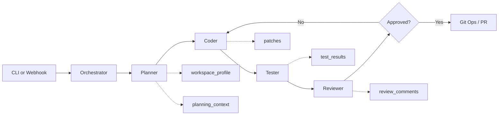
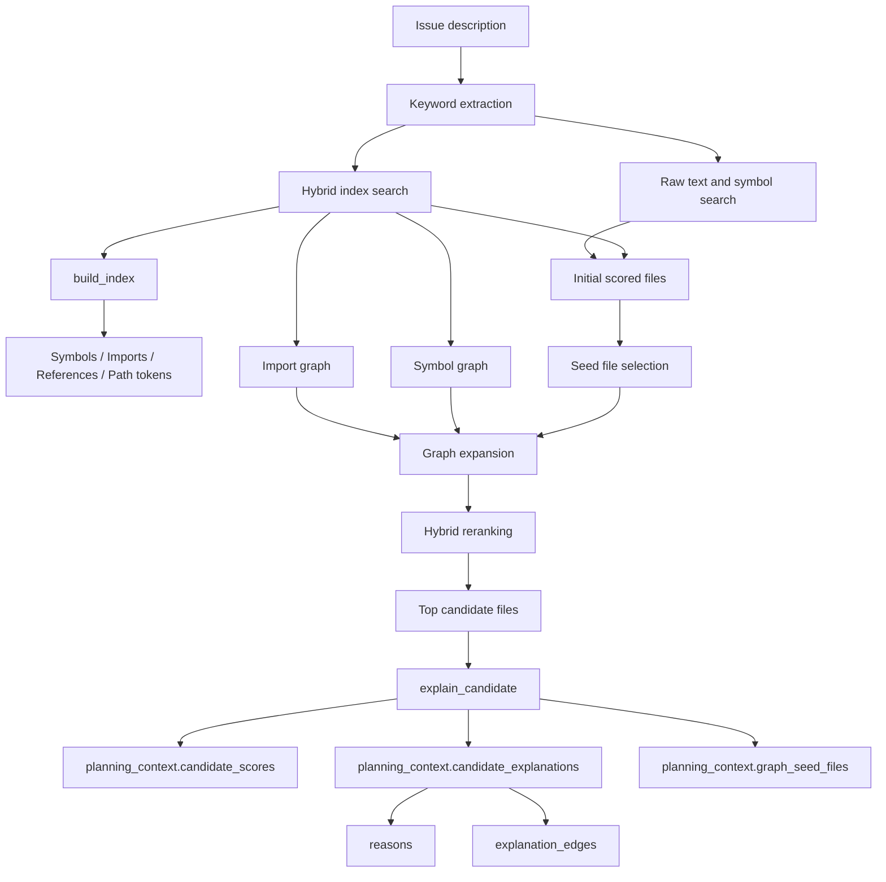

# AI Code Agent - Project Structure & Agent Guide

Welcome to the AI Code Agent project! This file serves as the primary documentation for both human developers and AI coding assistants navigating this repository.

## Purpose

This project is an autonomous software engineering agent system. It is designed to take an issue description, search the codebase, formulate a plan, edit code, run tests within a sandbox, and ultimately submit a Pull Request.

## Architecture Highlights

We use a Multi-Agent architecture orchestrated via a State Machine. When `langgraph` is installed the project uses it directly; otherwise it falls back to a local in-process executor so the CLI can still run smoke checks.

### End-to-End Flow

1. The CLI or webhook receives an issue description plus a repository path.
2. The orchestrator creates an `AgentState` payload and runs the planner, coder, tester, reviewer, and PR stages.
3. The planner profiles the workspace, retrieves relevant files, and records planning metadata in `planning_context`.
4. The coder applies deterministic framework-aware scaffolding when possible, then falls back to LLM-guided edits.
5. The tester runs repository-appropriate validation, using Docker when available or local execution as fallback.
6. The reviewer combines changed files, validation signals, and generated summaries to decide whether the run is acceptable.
7. If approved, the workflow can proceed to git operations and PR creation.

### Retrieval Architecture

The planner no longer relies only on raw text grep. Retrieval is now a hybrid pipeline built around `ai_code_agent/tools/code_search.py`.

- `build_index()` classifies files and extracts symbols, imports, import paths, references, and path tokens.
- `hybrid_search()` adds structured relevance scoring on top of simple keyword matching.
- `build_import_graph()` links files through resolved Python and JS/TS imports.
- `build_symbol_graph()` links files through symbol definition and usage relationships.
- `graph_related_files()` expands candidate sets from graph neighbors so the planner can pull in connected implementation files.
- `explain_candidate()` emits both human-readable `reasons` and machine-readable `explanation_edges` so retrieval decisions are inspectable.

The planner stores retrieval output in `planning_context`, including:

- `retrieval_strategy`
- `graph_seed_files`
- `candidate_scores`
- `candidate_explanations`
- `candidate_explanations_schema_version`

### Code Structure

- `/ai_code_agent/orchestrator.py`: The heart of the system. Defines the `AgentState` and the LangGraph flow connecting all agents.
- `/ai_code_agent/agents/`: Directory containing specific agent logic (`planner.py`, `coder.py`, `reviewer.py`, `tester.py`).
- `/ai_code_agent/tools/`: The Agent-Computer Interface (ACI). Tools for agents to touch the real world safely (e.g., `file_editor.py`, `code_search.py`, `sandbox.py`).
- `/ai_code_agent/integrations/`: Connectors to GitHub, Azure DevOps, etc.
- `/ai_code_agent/llm/`: Centralized LLM client and prompts.
- `/ai_code_agent/main.py`: CLI Entrypoint.
- `/ai_code_agent/webhook.py`: Server entrypoint for responding to events.

## Agent Workflow Loop

1. **Planner**: Decides *what* to do based on the issue and code context.
   Planner output also carries retrieval evidence in `planning_context` so downstream tooling can inspect why candidate files were selected.
2. **Coder**: Edits files based on the plan.
3. **Tester**: Runs smoke checks in a sandbox, falling back to local execution when Docker is unavailable.
4. **Reviewer**: Evaluates diffs and test results.
5. **Decide**: The orchestrator assesses the Reviewer's feedback. If failed, it loops back to Coder. If passed, it interacts with Git to create a PR.

## LLM Providers

- `anthropic`: direct Anthropic API
- `openai`: direct OpenAI API
- `openrouter`: OpenAI-compatible client pointed at OpenRouter so one API key can route across multiple upstream models

Use `LLM_PROVIDER=openrouter` with `OPENROUTER_API_KEY` and optionally `OPENROUTER_MODEL` to select the routed model.
You can also override models per role with `PLANNER_MODEL`, `CODER_MODEL`, `TESTER_MODEL`, and `REVIEWER_MODEL`.

## Runtime Support

Runtime version matrix for CI, local validation, and committed fixtures lives in `artifact/runtime_matrix.md`.

File-edit policy can be restricted with `AGENT_EDIT_ALLOW_GLOBS` and `AGENT_EDIT_DENY_GLOBS` as comma-separated glob lists. The deny list defaults to `.git/**`; when an allow list is present, coder operations outside that scope are blocked and recorded in `codegen_summary`.

- Python repositories are validated with compile and CLI smoke checks.
- JavaScript and TypeScript repositories are detected from `package.json` and lockfiles.
- The tester can detect `npm`, `pnpm`, and `yarn` and will run install/build/lint/test scripts when present.
- Framework markers for Next.js and NestJS are detected so planner and tester behavior can become framework-aware over time.
- Next.js workspaces are profiled for app router vs pages router, route files, layouts, API routes, and component directories.
- NestJS workspaces are profiled for root bootstrap files, modules, controllers, services, DTOs, and common HTTP-layer primitives.
- The tester can prefer Next.js-specific lint, typecheck, and build validation paths when a Next.js workspace is detected.
- The tester can prefer NestJS-specific script, typecheck, and build validation paths when a NestJS workspace is detected.
- The coder can deterministically scaffold or overwrite Next.js pages, layouts, components, and API routes for common feature requests before falling back to generic LLM editing.
- The Next.js deterministic scaffold path has started a frontend quality layer with design-direction-aware templates, App Router `loading.tsx` and `error.tsx` generation, and built-in loading/empty/error/success state coverage for generated components.
- The tester can pass Playwright-friendly visual review env vars to frontend screenshot scripts: `AI_CODE_AGENT_VISUAL_REVIEW_DIR`, `AI_CODE_AGENT_VISUAL_REVIEW_MANIFEST`, and `AI_CODE_AGENT_PLAYWRIGHT_SCREENSHOT_DIR`. If a `visual-review`, `screenshot`, or `test:visual` script writes a manifest plus screenshot files there, the tester attaches artifact metadata into `visual_review` for the reviewer.
- The coder can deterministically scaffold NestJS modules, controllers, services, DTOs, and root module registration for common backend feature requests.

## Evaluation Artifacts

- `artifact/run_nestjs_smoke.py`: End-to-end NestJS smoke harness used to validate framework-aware generation and reviewer approval.
- `artifact/fixtures/nestjs-smoke/`: Committed NestJS sample project used by the smoke harness.
- `artifact/fixtures/nextjs-visual-review/`: Committed Next.js sample project showing the Playwright screenshot/manifest contract used by frontend visual review.
- `artifact/run_nextjs_visual_review_smoke.py`: End-to-end visual-review smoke harness that installs the fixture, runs Playwright capture, and asserts manifest plus screenshot artifacts for CI.
- `artifact/runtime_matrix.md`: Runtime compatibility matrix covering Python, CI Node, and framework fixture minimums plus the reason each version is pinned.
- `artifact/execution_metrics_schema.md`: Run-level metrics and normalized event schema for production observability on top of `execution_events`, `codegen_summary`, `test_results`, and `review_summary`.
- `artifact/run_retrieval_eval.py`: Benchmark runner that compares `baseline` and `hybrid` retrieval modes.
- `artifact/fixtures/retrieval-eval-sample/`: Sample repository for retrieval benchmarking across backend and frontend cases.
- `ai_code_agent/validation.py`: Single entrypoint that supports `quick` and `full` validation modes. `full` runs compile checks, unit tests, framework smoke checks, and retrieval evaluation; `quick` runs compile plus unit tests only.
- `.github/workflows/validation.yml`: GitHub Actions workflow that runs the unified validation suite on `push` and `pull_request`.

Reviewer output now includes a structured `review_summary` with changed areas, validation pass/fail labels, visual-review findings, and residual risks so team review can scan results faster.

Execution traces now carry richer audit metadata in `execution_events`, including planner retrieval strategy and blocked targets, coder generation source and blocked operations, and reviewer summary status plus residual-risk counts.

Production observability should aggregate those raw traces into the run-level `execution_metrics` schema described in `artifact/execution_metrics_schema.md`.

Workflow runs can also persist the latest derived metrics artifact under `.ai-code-agent/runs/<run_id>/metrics.json` for operator diagnostics and CI artifact collection.

Use `RETRIEVAL_MODE=baseline` or `RETRIEVAL_MODE=hybrid` to compare planner behavior. The benchmark reports precision@k, recall@k, reciprocal rank, and NDCG@k.

## Getting Started

1. Copy `.env.example` to `.env` and fill in credentials.
2. Install dependencies via `poetry install`.
3. Build the sandbox image if you want Docker-backed execution: `docker build -t ai-code-agent-sandbox:latest .`
4. Run the CLI for an issue workflow: `poetry run ai-code-agent run --issue <issue_url> --repo <path>`
5. For repository readiness analysis, use a descriptive issue such as `poetry run ai-code-agent run --issue "analyze current repository and summarize readiness" --repo <path>`.
6. Run the CLI without API keys to use fallback mode for planning and smoke-test execution only.
7. Run `poetry run ai-code-agent health --role planner` to verify provider wiring and the effective model for a role.
8. Run `python artifact/run_retrieval_eval.py` to compare baseline and hybrid retrieval quality on the committed fixture.
9. Run `python -m ai_code_agent.validation --mode quick` for the fast local loop, or `python -m ai_code_agent.validation --mode full` to execute the full developer validation suite including NestJS and Next.js smoke fixtures. The same modes also work through `poetry run ai-code-agent-validate --mode ...`.
10. Use `AGENT_EDIT_ALLOW_GLOBS=src/**,docs/**` and/or `AGENT_EDIT_DENY_GLOBS=artifact/fixtures/**,.github/workflows/**` when you need policy-based file restrictions for team-safe editing.
11. Run `python -m ai_code_agent.main diagnose --repo <path>` to inspect the latest persisted workflow metrics artifact plus recent-run trends, add `--run-id <id>` for a specific run, use `--status` / `--failure-category` to narrow the recent-run view, use `--format json|ndjson|rows` for export-friendly output, and let all diagnose formats, including the default text view, reuse fresh persisted recent-run snapshots under `.ai-code-agent/diagnostics/` when they match the requested window and filters.
