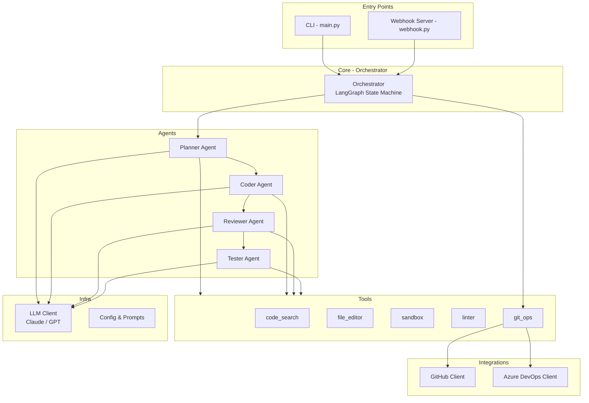

# AI Code Agent — Project Scaffolding

สร้างโครงสร้างโปรเจ็กต์ Python สำหรับ AI Agent ที่แก้ Code Issue ได้อัตโนมัติจนถึงขั้นเปิด PR  
โค้ดทั้งหมดเป็น **stubs** (มีเฉพาะ signature + docstring) เพื่อให้เริ่มทำงานได้เร็ว

## Architecture Overview



### Flow สรุปง่ายๆ

1. **Trigger** — รับ Issue จาก CLI หรือ Webhook
2. **Plan** — Planner Agent อ่าน Issue + ค้นหาโค้ดที่เกี่ยวข้อง → วางแผนแก้
3. **Code** — Coder Agent แก้ไขไฟล์ตามแผน
4. **Test** — Tester Agent รันเทสใน Sandbox
5. **Review** — Reviewer Agent ตรวจคุณภาพ diff
6. **PR** — ถ้าผ่านทุกขั้น → สร้าง Branch, Commit, เปิด PR อัตโนมัติ
7. **Loop** — ถ้าเทสไม่ผ่านหรือ Review ไม่ผ่าน → วนกลับไปแก้ (retry budget)

---

## Proposed Changes

### Project Root

#### [NEW] [pyproject.toml](file:///d:/work/agent/pyproject.toml)
- Python package config, dependencies: `langchain`, `langgraph`, `anthropic`, `openai`, `pygithub`, `fastapi`, `uvicorn`, `docker`, `python-dotenv`
- Scripts: `ai-code-agent = "ai_code_agent.main:cli"`

#### [NEW] [.env.example](file:///d:/work/agent/.env.example)
- ตัวอย่าง environment variables: `LLM_PROVIDER`, `ANTHROPIC_API_KEY`, `OPENAI_API_KEY`, `GITHUB_TOKEN`, `AZURE_DEVOPS_PAT`

#### [NEW] [Dockerfile](file:///d:/work/agent/Dockerfile)
- Sandbox image สำหรับรันเทสอย่างปลอดภัย (Python base + common tools)

#### [NEW] [AGENTS.md](file:///d:/work/agent/AGENTS.md)
- เอกสารอธิบายโครงสร้าง, วิธีรัน, ให้ AI อ่านเข้าใจโปรเจ็กต์ได้เอง

#### [NEW] [.gitignore](file:///d:/work/agent/.gitignore)
- ไฟล์มาตรฐาน Python

---

### Core Package — `ai_code_agent/`

#### [NEW] [\_\_init\_\_.py](file:///d:/work/agent/ai_code_agent/__init__.py)
- Package init

#### [NEW] [config.py](file:///d:/work/agent/ai_code_agent/config.py)
- `AgentConfig` dataclass — load from `.env` + overrides

#### [NEW] [orchestrator.py](file:///d:/work/agent/ai_code_agent/orchestrator.py)
- `AgentState` TypedDict (issue, plan, patches, test_result, review, attempt)
- `build_graph()` → LangGraph StateGraph ที่วาง node: plan → code → test → review → decide
- Conditional edge: ถ้า test fail หรือ review reject → loop กลับ code (มี max_retries)

---

### Agents — `ai_code_agent/agents/`

#### [NEW] [base.py](file:///d:/work/agent/ai_code_agent/agents/base.py)
- `BaseAgent` ABC — `run(state) -> state` + hold reference to LLM client

#### [NEW] [planner.py](file:///d:/work/agent/ai_code_agent/agents/planner.py)
- `PlannerAgent(BaseAgent)` — วิเคราะห์ issue, ค้นหาโค้ดที่เกี่ยวข้อง, สร้าง plan

#### [NEW] [coder.py](file:///d:/work/agent/ai_code_agent/agents/coder.py)
- `CoderAgent(BaseAgent)` — แก้ไขไฟล์ตาม plan ผ่าน file_editor tool

#### [NEW] [reviewer.py](file:///d:/work/agent/ai_code_agent/agents/reviewer.py)
- `ReviewerAgent(BaseAgent)` — ตรวจ diff สร้าง review comments

#### [NEW] [tester.py](file:///d:/work/agent/ai_code_agent/agents/tester.py)
- `TesterAgent(BaseAgent)` — เลือกเทสที่เกี่ยวข้อง, รันใน sandbox, รายงานผล

---

### Tools — `ai_code_agent/tools/`

#### [NEW] [code_search.py](file:///d:/work/agent/ai_code_agent/tools/code_search.py)
- `search_symbol()`, `search_text()`, `list_files()` — grep / ripgrep wrapper

#### [NEW] [file_editor.py](file:///d:/work/agent/ai_code_agent/tools/file_editor.py)
- `view_file()`, `replace_lines()`, `insert_lines()`, `create_file()` — ACI สำหรับแก้ไขไฟล์

#### [NEW] [sandbox.py](file:///d:/work/agent/ai_code_agent/tools/sandbox.py)
- `SandboxRunner` — รันคำสั่งใน Docker container (ตั้ง timeout, capture stdout/stderr)

#### [NEW] [linter.py](file:///d:/work/agent/ai_code_agent/tools/linter.py)
- `run_linter()` — เรียก ruff / eslint แล้ว parse ผลออกมา

#### [NEW] [git_ops.py](file:///d:/work/agent/ai_code_agent/tools/git_ops.py)
- `create_branch()`, `commit_changes()`, `push_branch()` — wrapper ทำ git operations

---

### Integrations — `ai_code_agent/integrations/`

#### [NEW] [github_client.py](file:///d:/work/agent/ai_code_agent/integrations/github_client.py)
- `GitHubClient` — fetch issues, create PR, post comments (ใช้ PyGithub)

#### [NEW] [azure_devops_client.py](file:///d:/work/agent/ai_code_agent/integrations/azure_devops_client.py)
- `AzureDevOpsClient` — stub สำหรับ ADO REST API (work items, repos, PRs)

---

### LLM — `ai_code_agent/llm/`

#### [NEW] [client.py](file:///d:/work/agent/ai_code_agent/llm/client.py)
- `LLMClient` — unified interface, factory method เลือก provider ตาม config

#### [NEW] [prompts.py](file:///d:/work/agent/ai_code_agent/llm/prompts.py)
- Prompt templates สำหรับแต่ละ agent (plan, code, review, test)

---

### Entry Points

#### [NEW] [main.py](file:///d:/work/agent/ai_code_agent/main.py)
- CLI entry point ด้วย `argparse`: `ai-code-agent run --issue <url_or_id> --repo <path>`

#### [NEW] [webhook.py](file:///d:/work/agent/ai_code_agent/webhook.py)
- FastAPI server รับ GitHub/ADO webhook events (issue opened, comment)

---

## Verification Plan

### Automated Tests
เป็นการ scaffold โปรเจ็กต์ (stubs เท่านั้น ยังไม่มี logic) จึงทดสอบแค่:
1. **Import test** — ตรวจว่าทุก module import ได้สำเร็จโดยไม่ error
```bash
cd d:\work\agent
python -c "from ai_code_agent import config, orchestrator; from ai_code_agent.agents import planner, coder, reviewer, tester; from ai_code_agent.tools import code_search, file_editor, sandbox, linter, git_ops; from ai_code_agent.integrations import github_client, azure_devops_client; from ai_code_agent.llm import client, prompts; print('All imports OK')"
```

### Manual Verification
- ตรวจดูโครงสร้างไฟล์ใน `d:\work\agent\` ว่าครบถ้วนตาม plan
